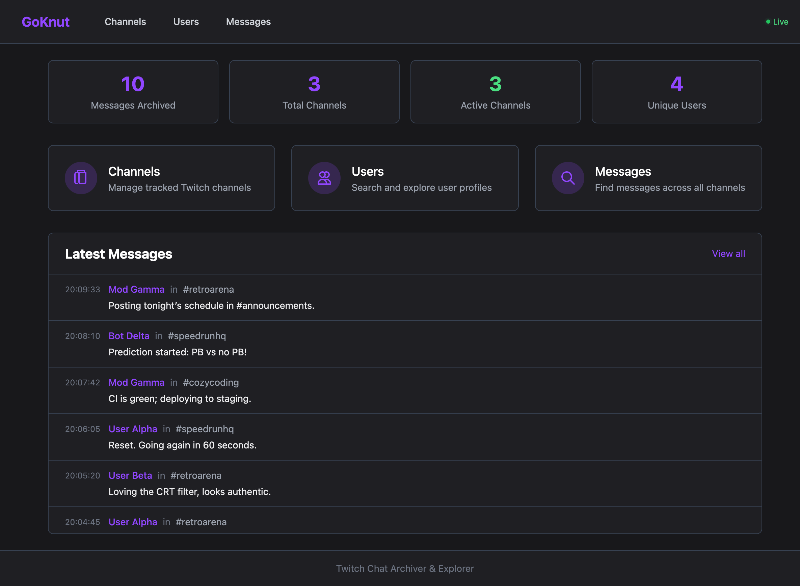
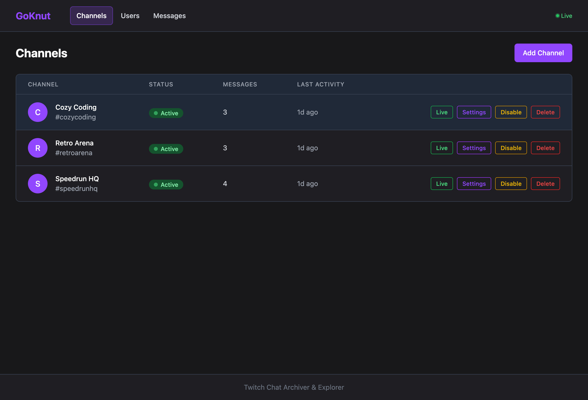
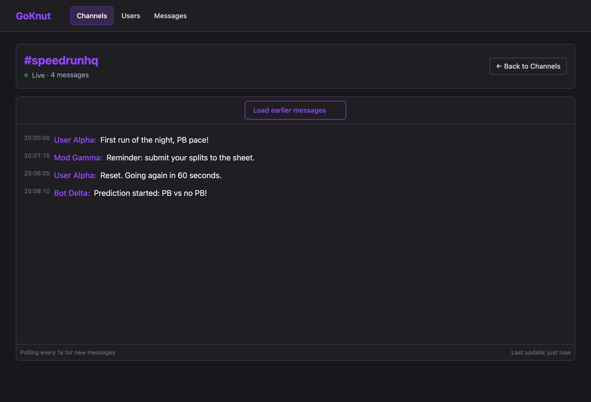
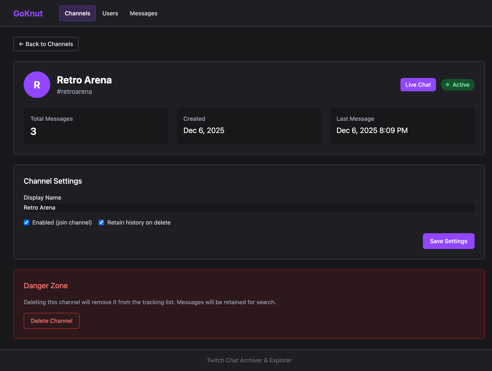
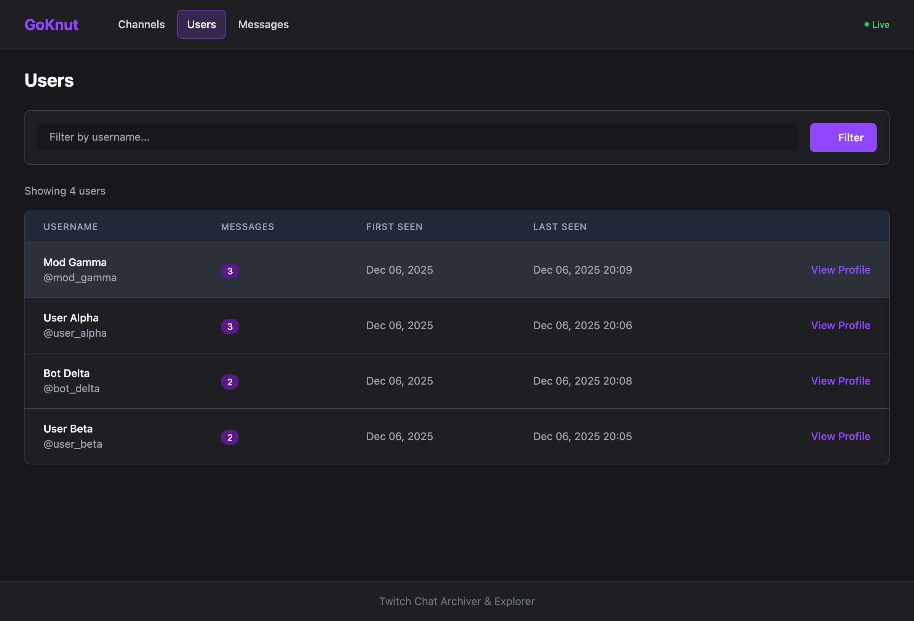
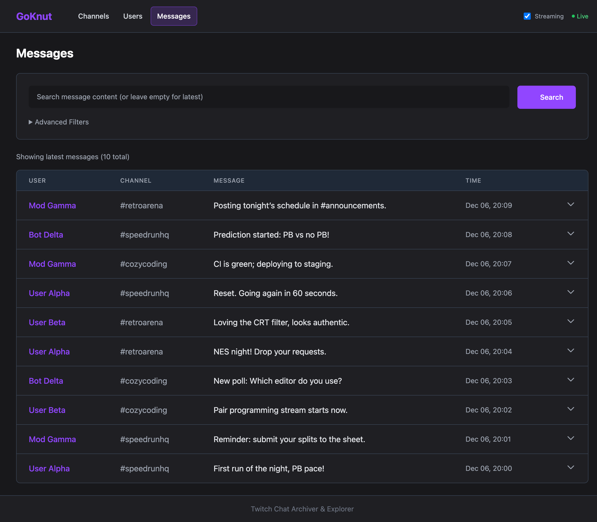
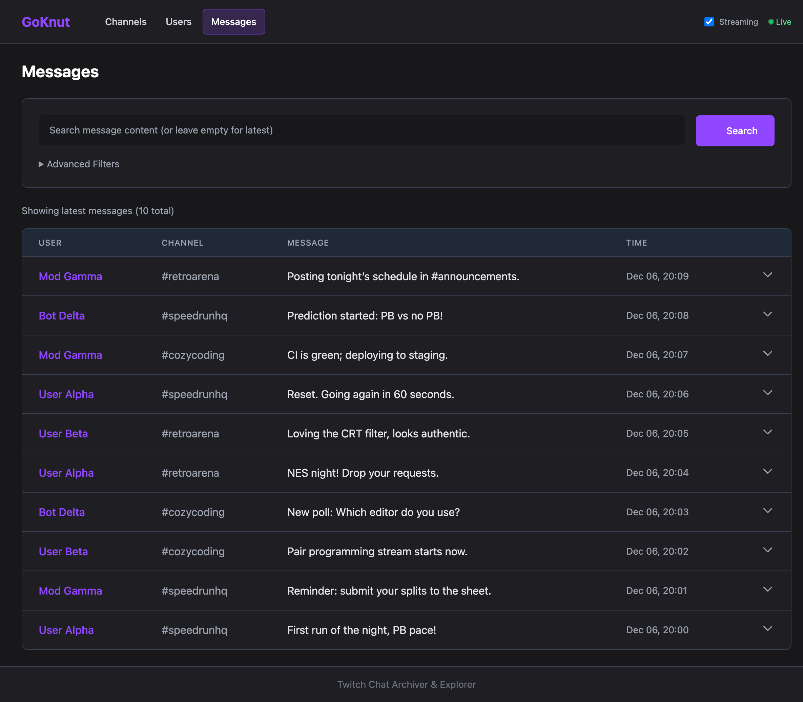

# GoKnut - Twitch Chat Archiver & Explorer

A welcoming guide to what this project is, how it’s organized, and how to try it locally with mock data (no real Twitch data required).

## What’s Inside
- `cmd/server`: Entry point for the single-binary server
- `internal/http`: Handlers, templates (HTMX + Tailwind), SSE for live updates
- `internal/ingestion`: Batched ingest pipeline from IRC into SQLite
- `internal/search`: FTS5/LIKE search over archived messages
- `internal/repository`: SQLite schema, migrations, and data access
- `internal/services`: Business logic for channels and search
- `tests`: Unit, integration, and contract suites
- `specs`: Living specs, plans, and contracts
- `docs/perf.md`: Performance targets and validation notes

## Key Features
- Archive Twitch chat messages to SQLite (WAL) with optional FTS5
- Live channel view with <1s updates via HTMX/SSE
- Search users and messages with filters (channel, user, time window)
- Server-rendered UI with Tailwind CSS and progressive enhancement

## Quick Start (Local)
1) Install Go 1.22+
2) Clone and build: `make build` (binary in `bin/goknut`)
3) Run with anonymous mode (no credentials):
   ```bash
   export TWITCH_AUTH_MODE=anonymous
   ./bin/goknut --db-path=./twitch.db --http-addr=:8080
   ```
4) Open `http://localhost:8080` for the UI

### Authenticated Mode (optional)
```bash
export TWITCH_USERNAME=your_username
export TWITCH_OAUTH_TOKEN=oauth:your_token
./bin/goknut --db-path=./twitch.db --http-addr=:8080
```

## Configuration (env or flags)
| Variable | Default | Description |
|----------|---------|-------------|
| `TWITCH_AUTH_MODE` | `authenticated` | `authenticated` or `anonymous` |
| `TWITCH_USERNAME` | - | Required for authenticated mode |
| `TWITCH_OAUTH_TOKEN` | - | Required for authenticated mode (prefix `oauth:`) |
| `TWITCH_CHANNELS` | - | Comma-separated channels to auto-join |
| `DB_PATH` | `./twitch.db` | SQLite path |
| `HTTP_ADDR` | `:8080` | HTTP listen address |
| `BATCH_SIZE` | `100` | Ingest batch size |
| `FLUSH_TIMEOUT` | `100` | Batch flush timeout (ms) |
| `ENABLE_FTS` | `true` | Enable FTS5 full-text search |
| `ENABLE_SSE` | `true` | Enable live SSE streaming |

Flags mirror these settings: `--db-path`, `--http-addr`, `--batch-size`, `--flush-timeout`, `--buffer-size`, `--enable-fts`.

## Mock Data & Screenshots
Captured with the fixture database and Playwright (all mocked data):
- `docs/images/home-dashboard.png` (Home/Dashboard)
- `docs/images/channels-list.png` (Channels list)
- `docs/images/channel-live.png` (Channel live view)
- `docs/images/channel-settings.png` (Channel settings/edit)
- `docs/images/users-list.png` (Users list)
- `docs/images/user-profile.png` (User profile)
- `docs/images/messages-list.png` (Messages view)
- `docs/images/search-results.png` (Search results)

Inline previews:









## Running from source
```bash
make run      # build+run in one step
make test     # run unit+integration+contract tests
make publish  # cross-compile artifacts to dist/
```

## Latency Targets
| Component | Target | Notes |
|-----------|--------|-------|
| Ingestion throughput | 100-150 msgs/sec | Batched writes + WAL |
| Live UI updates | < 1s | HTMX/SSE stream updates |
| HTTP p95 latency | < 250ms | All HTTP endpoints |
| HTTP p99 latency | < 500ms | All HTTP endpoints |
| Batch flush | < 100ms | Ingest batching timeout |

## Architecture (high level)
```
internal/
├── config/         Configuration loading and validation
├── http/           HTTP server, handlers, templates, SSE
├── ingestion/      Message batching and storage pipeline
├── irc/            Twitch IRC client with reconnection
├── observability/  Structured logging and metrics
├── repository/     SQLite repositories and migrations
├── search/         Full-text search (FTS5/LIKE)
└── services/       Business logic (channel, search)
```
